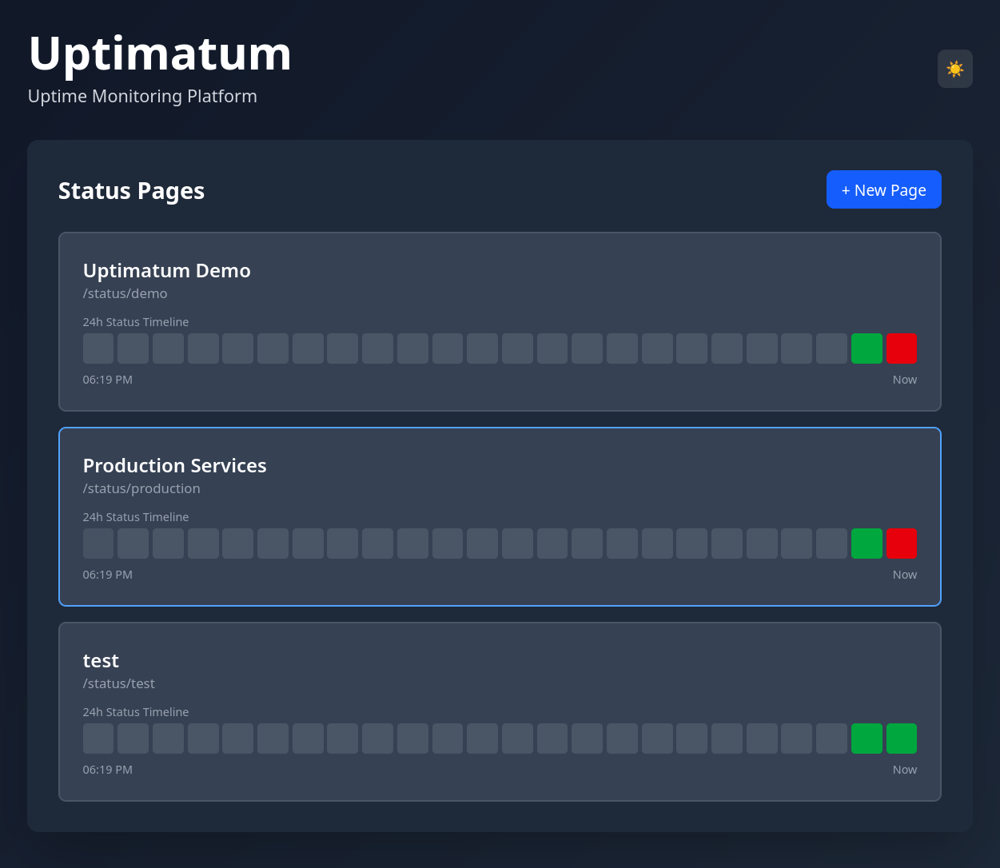
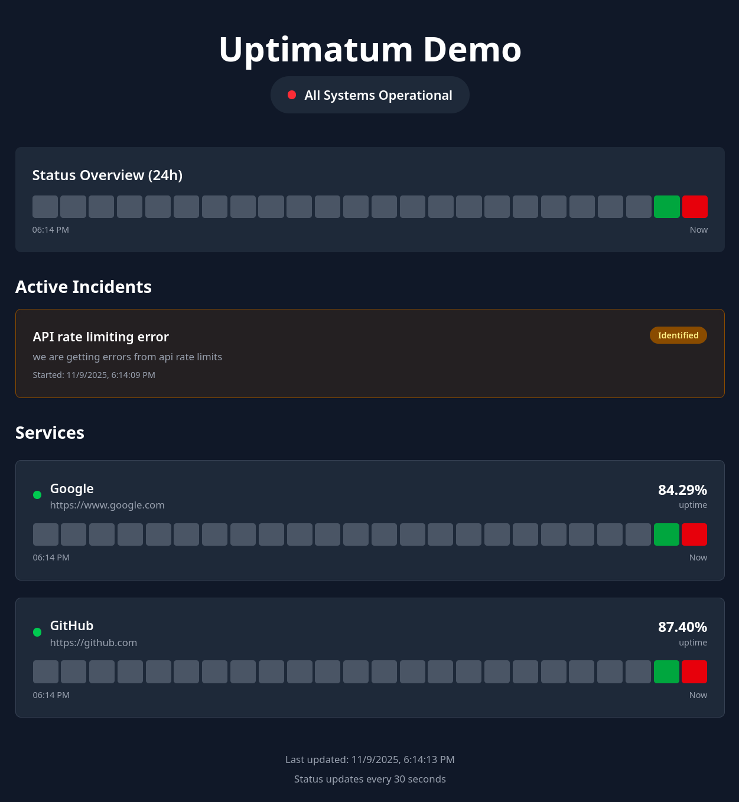
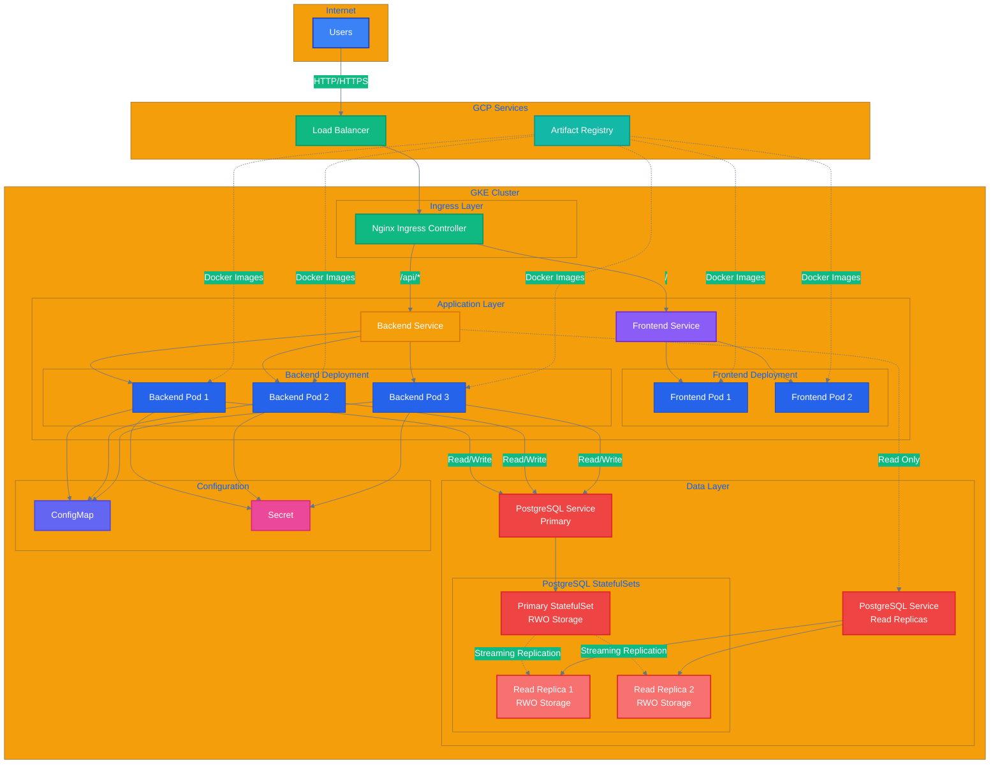
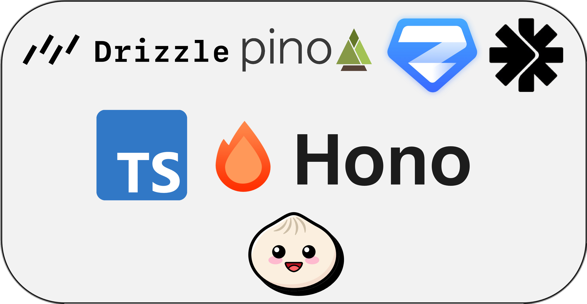
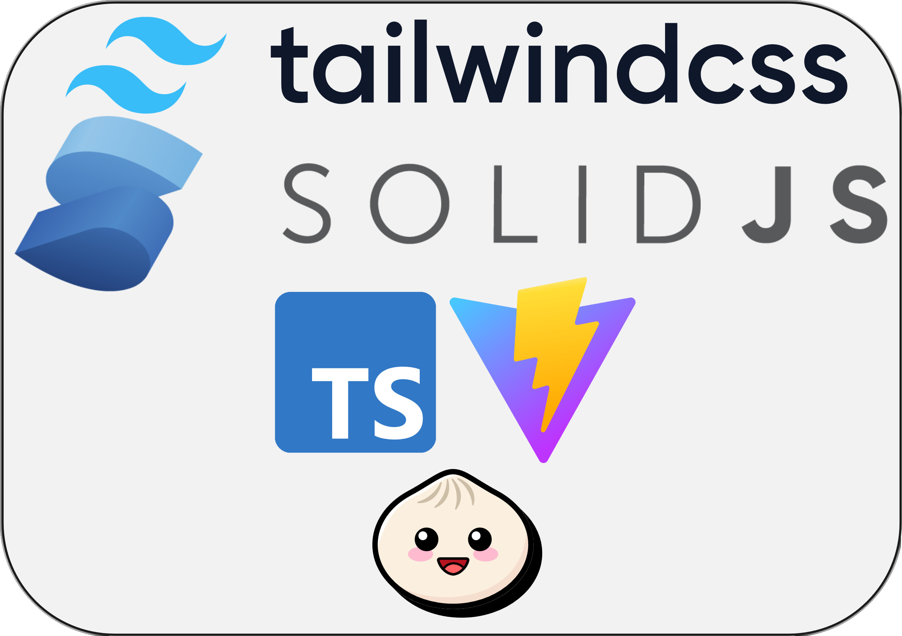
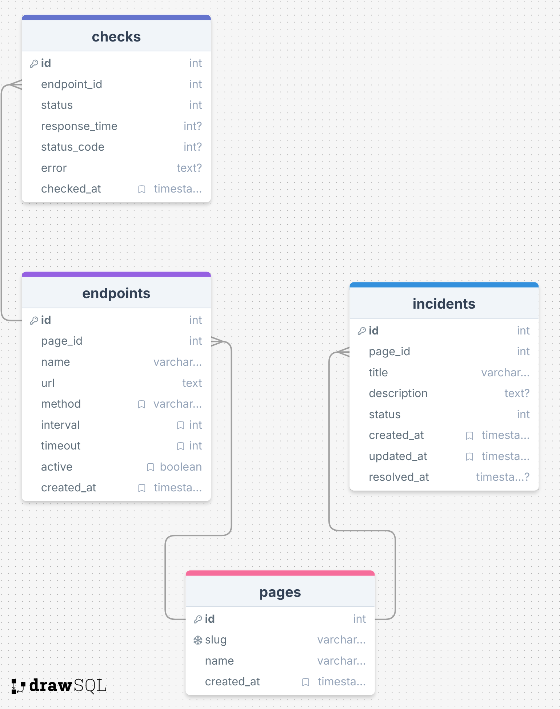

# Uptimatum

**The Ultimate Self-Hosted Status Page Platform**

A complete Kubernetes-based microservices application for monitoring endpoint uptime with real-time status pages, embeddable badges, and beautiful dashboards.

## Screenshots

### Dashboard



### Public Status Page



## Table of Contents

- [Uptimatum](#uptimatum)
  - [Screenshots](#screenshots)
    - [Dashboard](#dashboard)
    - [Public Status Page](#public-status-page)
  - [Table of Contents](#table-of-contents)
  - [Documentation](#documentation)
  - [Architecture](#architecture)
    - [System Architecture](#system-architecture)
    - [Backend Project Technologies](#backend-project-technologies)
    - [Frontend Project Technologies](#frontend-project-technologies)
    - [Database Schema](#database-schema)
  - [Tech Stack](#tech-stack)
  - [Quick Start](#quick-start)
    - [Prerequisites](#prerequisites)
    - [Option 1: Automated Setup (Recommended)](#option-1-automated-setup-recommended)
    - [Option 2: Manual Setup](#option-2-manual-setup)
    - [Access the Application](#access-the-application)
    - [Cleanup](#cleanup)
  - [Local Testing](#local-testing)
  - [Development](#development)
    - [Prerequisites](#prerequisites-1)
    - [Quick Test](#quick-test)
    - [Backend Setup](#backend-setup)
    - [Frontend Setup](#frontend-setup)
  - [Features](#features)
    - [Core Features](#core-features)
    - [Kubernetes Features](#kubernetes-features)
  - [Upcoming Features](#upcoming-features)
    - [Infrastructure \& Architecture](#infrastructure--architecture)
    - [Authentication \& Authorization](#authentication--authorization)
    - [Additional Planned Features](#additional-planned-features)
  - [Demo Script](#demo-script)
  - [API Endpoints](#api-endpoints)
    - [Health Check](#health-check)
    - [Pages](#pages)
    - [Endpoints](#endpoints)
    - [Incidents](#incidents)
    - [Badges](#badges)
  - [Configuration](#configuration)
    - [Environment Variables](#environment-variables)
  - [Troubleshooting](#troubleshooting)
    - [Port Conflicts](#port-conflicts)
    - [Database Connection Issues](#database-connection-issues)
    - [Frontend Can't Connect to Backend](#frontend-cant-connect-to-backend)
    - [Kubernetes Deployment Issues](#kubernetes-deployment-issues)
  - [Requirements Checklist](#requirements-checklist)
  - [Contributing](#contributing)
  - [Star History](#star-history)

## Documentation

- **[DEPLOYMENT.md](./DEPLOYMENT.md)** - Complete deployment guide (GCP setup from scratch)
- **[LOCAL_TESTING.md](./LOCAL_TESTING.md)** - Local development and testing guide
- **[DOCKER.md](./DOCKER.md)** - Docker and Artifact Registry guide
- **[backend/README.md](./backend/README.md)** - Backend API documentation
- **[frontend/README.md](./frontend/README.md)** - Frontend development guide
- **[scripts/README.md](./scripts/README.md)** - Deployment scripts documentation
- **[ui_showcase/README.md](./ui_showcase/README.md)** - UI screenshots and showcase

## Architecture

### System Architecture



### Backend Project Technologies



### Frontend Project Technologies



### Database Schema



**Requirements:**

- [x] 2 Deployments: Frontend (2 replicas), Backend (3 replicas) with rolling updates
- [x] Multiple Services: frontend-service, backend-service
- [x] Ingress: Path-based routing
- [x] ConfigMap + Secret: App config + DB credentials
- [x] StatefulSet: PostgreSQL HA cluster (1 primary + 2 read-only replicas) via Bitnami PostgreSQL Helm chart

## Tech Stack

- **Frontend**: SolidJS + TypeScript + TailwindCSS
- **Backend**: Hono + Bun + Drizzle ORM
- **Database**: PostgreSQL HA (Bitnami PostgreSQL Helm chart - 1 primary + 2 read-only replicas using StatefulSets)
- **Infrastructure**: Google Kubernetes Engine (GKE)
- **Container Registry**: Google Artifact Registry

## Quick Start

### Prerequisites

- Google Cloud SDK (`gcloud`) installed and configured
- `kubectl` installed
- `helm` installed
- `bun` installed (or use nvm + bun)
- A GCP project with billing enabled

### Option 1: Automated Setup (Recommended)

**Complete setup from scratch:**

```bash
./scripts/setup.sh
```

This master script will:

- Enable required GCP APIs
- Create Artifact Registry
- Create GKE cluster with autoscaling
- Install Nginx Ingress Controller
- Setup PostgreSQL HA cluster (3 nodes)
- Build and deploy application

**Time:** ~15-20 minutes

**For detailed step-by-step instructions, see [DEPLOYMENT.md](./DEPLOYMENT.md)**

### Option 2: Manual Setup

If you prefer to run each step individually:

```bash
# Step 1: Setup infrastructure (GKE, Artifact Registry, Ingress)
./scripts/setup-infra.sh

# Step 2: Setup database
./scripts/setup-db.sh

# Step 3: Build and deploy
./scripts/deploy.sh
```

### Access the Application

```bash
# Get the external IP
kubectl get ingress uptimatum-ingress -n uptimatum -o jsonpath='{.status.loadBalancer.ingress[0].ip}'

# Access the dashboard
# http://<EXTERNAL_IP>/status/demo
```

**Note:** It may take 2-5 minutes for the IP to be assigned.

### Cleanup

To remove all resources:

```bash
./scripts/cleanup.sh
```

## Local Testing

**Quick Start:**

```bash
# Automated setup (recommended)
./scripts/test-local.sh
```

This script will:

- Start PostgreSQL in Docker
- Setup backend with database migrations
- Start backend server
- Start frontend server

**Manual Setup:**
See [LOCAL_TESTING.md](./LOCAL_TESTING.md) for detailed instructions.

**Using Docker Compose:**

```bash
# Start PostgreSQL only
docker-compose up -d postgres

# Then run backend and frontend manually (see LOCAL_TESTING.md)
```

## Development

### Prerequisites

- Node.js (use nvm with `.nvmrc` file)
- Bun (or npm/pnpm/yarn)
- PostgreSQL (local or Docker)
- Docker & Docker Compose (optional, for PostgreSQL)

### Quick Test

```bash
# Start PostgreSQL
docker-compose up -d postgres

# In terminal 1: Start backend
cd backend && bun install && cp .env.example .env && bun run db:push && bun run dev

# In terminal 2: Start frontend
cd frontend && bun install && bun run dev
```

### Backend Setup

```bash
cd backend
source ~/.nvm/nvm.sh && nvm use
bun install

# Copy and configure environment variables
cp .env.example .env
# Edit .env if needed (defaults work with docker-compose postgres)

# Setup database
bun run db:generate
bun run db:push

# Start development server
bun run dev
```

The backend runs on `http://localhost:3000` with hot reload.

**API Documentation:**

- OpenAPI Spec: <http://localhost:3000/doc>
- Interactive Docs: <http://localhost:3000/reference>

### Frontend Setup

```bash
cd frontend
source ~/.nvm/nvm.sh && nvm use
bun install

# Copy environment file (optional, defaults work for local dev)
cp .env.example .env

# Start development server
bun run dev
```

The frontend runs on `http://localhost:5173` and automatically proxies API requests to the backend.

**Note:** The frontend runs on port 5173 and the backend on port 3000. The frontend Vite dev server proxies `/api`, `/badge`, `/doc`, and `/reference` to the backend automatically.

**For detailed local testing instructions, see [LOCAL_TESTING.md](./LOCAL_TESTING.md)**

## Features

### Core Features

- **Multi-Endpoint Monitoring**: Monitor multiple endpoints/services
- **Real-Time Status**: Live updates every 30 seconds
- **Uptime Tracking**: 24-hour uptime percentage calculation
- **Response Time Metrics**: Track response times for each endpoint
- **Status Timeline**: Visual timeline showing status history
- **Incident Management**: Track and communicate service outages
- **Status Pages**: Beautiful, customizable status pages
- **Public Status Pages**: Shareable public-facing status pages
- **Embeddable Widgets**: Embed status widgets in any website
- **Status Badges**: SVG badges for README files and websites
- **Dark Mode**: Automatic theme switching with system preference
- **Mobile Responsive**: Fully responsive design for all devices
- **Optimized Database Writes**: Only inserts new rows when status changes, updates timestamps otherwise

### Kubernetes Features

- **Rolling Updates**: Zero-downtime deployments
- **Auto-Scaling**: GKE cluster autoscaling (3-6 nodes)
- **Health Checks**: Liveness and readiness probes
- **Resource Limits**: CPU and memory limits configured
- **High Availability**: 3-node PostgreSQL cluster
- **Ingress Routing**: Path-based routing for API and frontend
- **StatefulSets**: PostgreSQL cluster with persistent storage

## Upcoming Features

We're continuously improving Uptimatum. Here are some features planned for future releases:

### Infrastructure & Architecture

- [ ] **Kafka Message Queue**: Event-driven architecture for better scalability and reliability
  - [ ] Event-based database updates to prevent race conditions
  - [ ] Decouple services from direct database writes
  - [ ] Eliminate concurrent write conflicts (multiple backend instances updating the same row)
  - [ ] Simplify better-auth integration with event-driven user management
  - [ ] Enable real-time event streaming for status updates
  - [ ] Support for event replay and audit trails

**Benefits:**

- **Race Condition Prevention**: Kafka ensures ordered, sequential processing of database updates
- **Better Scalability**: Services can scale independently without database contention
- **Simplified Architecture**: Event-driven pattern makes authentication and data flow more straightforward
- **Reliability**: Message persistence and replay capabilities improve system resilience

### Authentication & Authorization

- [ ] **Better-Auth Integration**: Secure authentication system using [better-auth](https://www.better-auth.com/)
  - [ ] User registration and login
  - [ ] Role-based access control (Admin, Viewer)
  - [ ] Protected admin routes for status page management
  - [ ] Public access to status pages without authentication
  - [ ] Session management and secure token handling
  - [ ] Event-driven user management via Kafka (simplifies integration)

This will enable:

- [ ] **Admin Dashboard**: Secure access to create, edit, and manage status pages
- [ ] **Public Status Pages**: Unrestricted public access to view status information
- [ ] **Multi-User Support**: Multiple administrators with different permission levels
- [ ] **API Security**: Protected API endpoints for management operations

### Additional Planned Features

- [ ] **Email Notifications**: Alert administrators when endpoints go down
- [ ] **Webhook Support**: Integrate with Slack, Discord, and other services
- [ ] **Custom Status Page Themes**: Customizable branding and styling
- [ ] **Advanced Analytics**: Detailed uptime reports and historical data
- [ ] **API Rate Limiting**: Protect API endpoints from abuse
- [ ] **Multi-Language Support**: Internationalization for status pages

## Demo Script

Run the demo script to showcase all Kubernetes features:

```bash
./scripts/demo.sh
```

This demonstrates:

1. Pod distribution across nodes
2. StatefulSet with persistent volumes
3. ConfigMap and Secret usage
4. Ingress and external access
5. Horizontal scaling
6. Rolling updates

## API Endpoints

### Health Check

```plaintext
GET /health
```

### Pages

```plaintext
GET /api/pages                    # List all status pages
GET /api/pages/:slug              # Get page with endpoints and stats
GET /api/pages/:slug/timeline     # Get page timeline data
POST /api/pages                   # Create new status page
PATCH /api/pages/:slug            # Update status page
```

### Endpoints

```plaintext
GET /api/endpoints/:id/history    # Get check history
POST /api/endpoints               # Create new endpoint
DELETE /api/endpoints/:id         # Delete endpoint
```

### Incidents

```plaintext
GET /api/incidents?page_id=:id    # List incidents for a page
POST /api/incidents               # Create new incident
PATCH /api/incidents/:id          # Update incident
DELETE /api/incidents/:id         # Delete incident
```

### Badges

```plaintext
GET /badge/:slug                  # Get SVG status badge
```

## Configuration

### Environment Variables

**Backend (Local Development):**

See `backend/.env.example` for all available variables.

**Backend (Kubernetes - via ConfigMap):**

- `DB_HOST`: PostgreSQL connection host
- `DB_PORT`: PostgreSQL port (default: 5432)
- `DB_NAME`: Database name
- `CHECK_INTERVAL`: Health check interval in seconds
- `CHECK_TIMEOUT`: Request timeout in seconds
- `PORT`: Server port

**Backend (Kubernetes - via Secret):**

- `DB_USER`: Database username
- `DB_PASSWORD`: Database password

**Frontend (Local Development):**

- `VITE_API_URL`: Backend API URL (optional, defaults to `http://localhost:3000`)

In production, the frontend uses relative paths and nginx handles API proxying.

## Troubleshooting

### Port Conflicts

If you get port conflicts, you can change the ports:

- **Backend**: Set `PORT` in `backend/.env`
- **Frontend**: Change `server.port` in `frontend/vite.config.ts`

### Database Connection Issues

1. Verify PostgreSQL is running: `psql -h localhost -U uptimatum -d uptimatum`
2. Check environment variables in `backend/.env`
3. Ensure database exists: `CREATE DATABASE uptimatum;`

### Frontend Can't Connect to Backend

1. Ensure backend is running on the expected port
2. Check `VITE_API_URL` in `frontend/.env` (if set)
3. Verify Vite proxy configuration in `vite.config.ts`

### Kubernetes Deployment Issues

1. Check pod logs: `kubectl logs -n uptimatum deployment/backend`
2. Verify ConfigMap and Secret: `kubectl get configmap,secret -n uptimatum`
3. Check ingress: `kubectl describe ingress -n uptimatum`

## Requirements Checklist

- **2 Deployments**: Frontend (2 replicas), Backend (3 replicas)
- **Rolling Updates**: Configured with `maxSurge` and `maxUnavailable`
- **Multiple Services**: `frontend-service`, `backend-service`
- **Ingress**: Nginx Ingress with path-based routing
- **ConfigMap**: Application configuration
- **Secret**: Database credentials
- **PostgreSQL StatefulSet**: PostgreSQL HA cluster (1 primary + 2 read-only replicas) using Bitnami Helm chart
- **StorageClass**: PersistentVolumeClaims for each StatefulSet pod (RWO for primary, RWO for each replica)
- **Unique**: Self-hosted status page platform with embeds

## Contributing

1. Fork the repository
2. Create a feature branch
3. Make your changes
4. Submit a pull request

**Uptimatum** - The Ultimate Uptime Monitor

## Star History

[](https://www.star-history.com/#MemerGamer/Uptimatum&type=date&legend=top-left)
