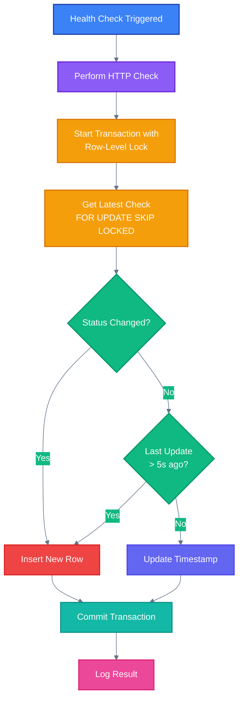

# Uptimatum Backend

The Ultimate Self-Hosted Status Page Platform API

## Table of Contents

- [Uptimatum Backend](#uptimatum-backend)
  - [Table of Contents](#table-of-contents)
  - [Features](#features)
  - [Setup](#setup)
    - [Prerequisites](#prerequisites)
    - [Installation](#installation)
  - [API Documentation](#api-documentation)
  - [Database](#database)
    - [Commands](#commands)
    - [Schema](#schema)
  - [Routes Structure](#routes-structure)
  - [API Endpoints](#api-endpoints)
    - [Health Check](#health-check)
    - [Pages](#pages)
    - [Endpoints](#endpoints)
    - [Incidents](#incidents)
    - [Badges](#badges)
  - [Environment Variables](#environment-variables)
  - [Development](#development)
    - [Tech Stack](#tech-stack)
    - [Hot Reload](#hot-reload)
  - [Production](#production)
    - [Docker](#docker)
    - [Kubernetes](#kubernetes)
  - [Health Checker](#health-checker)
    - [Database Write Optimization](#database-write-optimization)

## Features

- **Type-safe API** with OpenAPI documentation
- **Interactive API docs** with Scalar
- **Structured logging** with Pino
- **Type-safe environment variables** with Zod
- **Drizzle ORM** with migrations (no raw SQL)
- **PostgreSQL** database
- **Health checker** worker with cron scheduling
- **Incident management** API for tracking service outages
- **Timeline API** for status history visualization
- **Optimized database writes** - Only inserts when status changes, updates timestamps otherwise

## Setup

### Prerequisites

- Node.js (use nvm with `.nvmrc`)
- Bun (or npm/pnpm/yarn)
- PostgreSQL (local or remote)

### Installation

1. Install dependencies:

```bash
source ~/.nvm/nvm.sh && nvm use
bun install
```

2. Create `.env` file:

```bash
cp .env.example .env
```

Edit `.env` with your database credentials:

```env
DB_HOST=localhost
DB_PORT=5432
DB_NAME=uptimatum
DB_USER=uptimatum
DB_PASSWORD=your_password
PORT=3000
CHECK_INTERVAL=30
CHECK_TIMEOUT=10
CHECK_RETENTION_DAYS=30
NODE_ENV=development
```

3. Generate and run migrations:

```bash
bun run db:generate
bun run db:push
```

4. Start the server:

```bash
bun run dev
```

The API will be available at `http://localhost:3000`

## API Documentation

- **OpenAPI Spec**: http://localhost:3000/doc
- **Interactive Docs**: http://localhost:3000/reference (Scalar)

## Database

### Commands

- `bun run db:generate` - Generate migration files from schema
- `bun run db:push` - Push schema changes directly to database
- `bun run db:migrate` - Run pending migrations
- `bun run db:studio` - Open Drizzle Studio (database GUI)

### Schema

The database schema is defined in `src/db/schema.ts` using Drizzle ORM:

- `pages` - Status pages
- `endpoints` - Monitored endpoints
- `checks` - Health check results
- `incidents` - Service incidents and outages

## Routes Structure

All routes follow the OpenAPI structure:

- `routes/{group}/` - Route group folder
- `{group}.index.ts` - Router setup
- `{group}.routes.ts` - OpenAPI route definitions with Zod schemas
- `{group}.handlers.ts` - Request handlers

## API Endpoints

### Health Check

```plaintext
GET /health
```

### Pages

```plaintext
GET /api/pages                    # List all status pages
GET /api/pages/:slug              # Get page with endpoints and stats
GET /api/pages/:slug/timeline     # Get page timeline data
POST /api/pages                   # Create new status page
PATCH /api/pages/:slug            # Update status page
```

### Endpoints

```plaintext
GET /api/endpoints/:id/history    # Get check history
POST /api/endpoints               # Create new endpoint
DELETE /api/endpoints/:id         # Delete endpoint
```

### Incidents

```plaintext
GET /api/incidents?page_id=:id    # List incidents for a page
POST /api/incidents                # Create new incident
PATCH /api/incidents/:id          # Update incident
DELETE /api/incidents/:id        # Delete incident
```

### Badges

```plaintext
GET /badge/:slug                  # Get SVG status badge
```

## Environment Variables

| Variable               | Description                     | Default       |
| ---------------------- | ------------------------------- | ------------- |
| `DB_HOST`              | PostgreSQL host                 | -             |
| `DB_PORT`              | PostgreSQL port                 | `5432`        |
| `DB_NAME`              | Database name                   | -             |
| `DB_USER`              | Database user                   | -             |
| `DB_PASSWORD`          | Database password               | -             |
| `PORT`                 | Server port                     | `3000`        |
| `CHECK_INTERVAL`       | Health check interval (seconds) | `30`          |
| `CHECK_TIMEOUT`        | Request timeout (seconds)       | `10`          |
| `CHECK_RETENTION_DAYS` | Days to keep check records      | `30`          |
| `NODE_ENV`             | Environment                     | `development` |

## Development

### Tech Stack

- **Hono** - Fast web framework with OpenAPI support
- **Drizzle ORM** - Type-safe SQL ORM
- **Zod** - Schema validation
- **Pino** - Structured logging
- **Bun** - Runtime and package manager
- **node-cron** - Scheduled health checks

### Hot Reload

The development server uses Bun's hot reload:

```bash
bun run dev
```

Changes to TypeScript files will automatically restart the server.

## Production

### Docker

Build and run:

```bash
docker build -t uptimatum-backend .
docker run -p 3000:3000 --env-file .env uptimatum-backend
```

### Kubernetes

The backend is deployed as a Kubernetes deployment with:

- 3 replicas for high availability
- Rolling updates configured
- Health checks (liveness & readiness probes)
- Resource limits
- Environment variables from ConfigMap and Secret

## Health Checker

The health checker worker runs every 30 seconds (configurable via `CHECK_INTERVAL`) and:

1. Fetches all active endpoints
2. Performs HTTP checks
3. Records results in the database using optimized writes:
   - **Inserts new row** only when status changes
   - **Updates timestamp** when status is the same (with 5-second threshold to prevent too frequent updates)
   - Uses **row-level locking** to prevent race conditions from parallel instances
4. Logs status using Pino logger

### Database Write Optimization

The health checker implements intelligent write optimization:



This approach:
- **Reduces database writes** by ~95% when status is stable
- **Prevents race conditions** using PostgreSQL row-level locking
- **Maintains accuracy** by updating response times and metadata
- **Handles concurrent instances** safely with `SKIP LOCKED`

Additionally, a cleanup job runs daily at 2 AM to remove check records older than `CHECK_RETENTION_DAYS` (default: 30 days) to prevent unbounded database growth.
