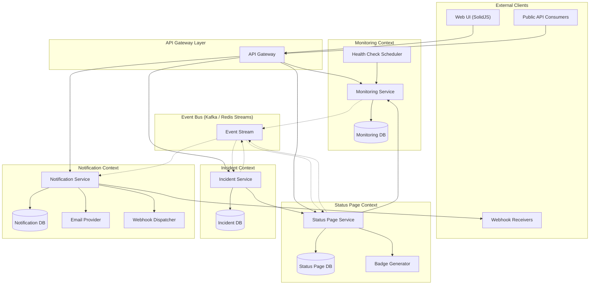
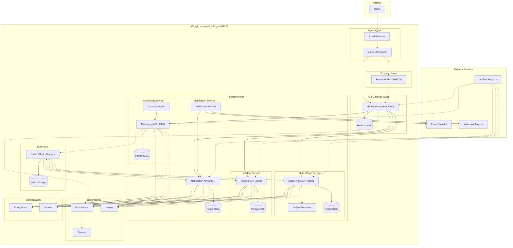

# Uptimatum - Microservices Architecture Design

This document outlines the proposed microservices architecture for Uptimatum, following **Domain-Driven Design (DDD)** principles to refactor the current monolithic application into a scalable, maintainable microservices ecosystem.

## Table of Contents

- [Executive Summary](#executive-summary)
- [Current State Analysis](#current-state-analysis)
- [1. Functional Architecture (Domain-Driven Design)](#1-functional-architecture-domain-driven-design)
  - [1.1 Bounded Contexts](#11-bounded-contexts)
  - [1.2 Domain Model](#12-domain-model)
  - [1.3 Functional Architecture Diagram](#13-functional-architecture-diagram)
- [2. Technical Architecture](#2-technical-architecture)
  - [2.1 Technology Stack](#21-technology-stack)
  - [2.2 Technical Architecture Diagram](#22-technical-architecture-diagram)
  - [2.3 Communication Patterns](#23-communication-patterns)
- [3. Migration Strategy](#3-migration-strategy)
- [4. Benefits and Trade-offs](#4-benefits-and-trade-offs)

---

## Executive Summary

Uptimatum is currently a monolithic application with a single backend service handling all business logic. This design proposes decomposing it into **5 core microservices** based on DDD bounded contexts:

1. **Monitoring Service** - Core endpoint health checking
2. **Status Page Service** - Status page management and public access
3. **Incident Management Service** - Incident tracking and communication
4. **Notification Service** - Alert distribution (email, webhooks, etc.)
5. **API Gateway** - Entry point, routing, and authentication

This architecture enables independent scaling, improved fault isolation, and better team organization around domain boundaries.

---

## Current State Analysis

### Current Architecture

- **Monolithic Backend**: Single Hono/Bun application handling all domains
- **Database**: Single PostgreSQL database with all tables
- **Frontend**: SolidJS SPA communicating with monolithic API
- **Infrastructure**: Kubernetes with 3 backend replicas

### Pain Points

1. **Tight Coupling**: All domains share the same codebase and database
2. **Scaling Limitations**: Cannot scale individual features independently
3. **Race Conditions**: Multiple instances writing to the same database rows (partially mitigated with row-level locking)
4. **Deployment Risk**: Single deployment unit - changes to any feature require full deployment
5. **Development Bottlenecks**: Teams cannot work independently on different domains

---

## 1. Functional Architecture (Domain-Driven Design)

### 1.1 Bounded Contexts

Based on DDD principles, we identify the following bounded contexts:

#### **1. Monitoring Context**

**Core Domain Responsibility**: Endpoint health checking and metrics collection

- **Aggregates**:
  - `Endpoint` (root): Represents a monitored endpoint
  - `Check`: Individual health check result
- **Value Objects**: `HealthCheckConfig`, `ResponseMetrics`
- **Domain Events**:
  - `EndpointChecked`
  - `EndpointStatusChanged`
  - `EndpointAdded`
  - `EndpointRemoved`

#### **2. Status Page Context**

**Core Domain Responsibility**: Status page creation and presentation

- **Aggregates**:
  - `StatusPage` (root): Represents a public status page
  - `PageComponent`: Configurable components on a page
- **Value Objects**: `PageTheme`, `PageConfiguration`
- **Domain Events**:
  - `StatusPageCreated`
  - `StatusPageUpdated`
  - `StatusPagePublished`

#### **3. Incident Management Context**

**Core Domain Responsibility**: Incident lifecycle management

- **Aggregates**:
  - `Incident` (root): Service disruption incident
  - `IncidentUpdate`: Timeline of incident updates
- **Value Objects**: `IncidentSeverity`, `IncidentStatus`
- **Domain Events**:
  - `IncidentCreated`
  - `IncidentStatusChanged`
  - `IncidentResolved`

#### **4. Notification Context**

**Core Domain Responsibility**: Alert and notification delivery

- **Aggregates**:
  - `NotificationChannel` (root): Configuration for notification delivery
  - `NotificationTemplate`: Message templates
- **Value Objects**: `ChannelType`, `NotificationPreference`
- **Domain Events**:
  - `NotificationSent`
  - `NotificationFailed`
  - `ChannelConfigured`

#### **5. User & Access Context** _(Future)_

**Core Domain Responsibility**: Authentication, authorization, and user management

- **Aggregates**:
  - `User` (root): System user
  - `ApiKey`: API access credentials
- **Value Objects**: `Role`, `Permission`
- **Domain Events**:
  - `UserRegistered`
  - `UserAuthenticated`
  - `PermissionGranted`

### 1.2 Domain Model

**Context Map Relationships**:

- Monitoring Context → Status Page Context: **Partnership** (bidirectional dependency)
- Monitoring Context → Incident Context: **Customer/Supplier** (monitoring provides data)
- Incident Context → Notification Context: **Customer/Supplier** (incidents trigger notifications)
- All Contexts → User Context: **Conformist** (all contexts consume user/auth data)

### 1.3 Functional Architecture Diagram



**Key Domain Boundaries**:

- Each bounded context has its own database (Database per Service pattern)
- Communication between contexts happens via:
  - **Event Bus** (asynchronous, eventual consistency)
  - **API Gateway** (synchronous, when strong consistency needed)
- Shared kernel is minimal (only common types like `timestamp`, `id`)

---

## 2. Technical Architecture

### 2.1 Technology Stack

#### **Core Services**

| Service              | Technology        | Database      | Port |
| -------------------- | ----------------- | ------------- | ---- |
| Monitoring Service   | Hono + Bun        | PostgreSQL    | 3001 |
| Status Page Service  | Hono + Bun        | PostgreSQL    | 3002 |
| Incident Service     | Hono + Bun        | PostgreSQL    | 3003 |
| Notification Service | Hono + Bun        | PostgreSQL    | 3004 |
| API Gateway          | Hono + Bun / Kong | Redis (cache) | 3000 |

#### **Infrastructure Components**

- **Event Bus**: Kafka (production) or Redis Streams (lightweight alternative)
- **Service Discovery**: Kubernetes DNS / Consul
- **Configuration**: Kubernetes ConfigMaps + Secrets / Consul KV
- **Monitoring**: Prometheus + Grafana
- **Logging**: ELK Stack (Elasticsearch, Logstash, Kibana) or Loki
- **Tracing**: Jaeger / Tempo
- **API Gateway**: Kong / Nginx / Custom Hono Gateway

#### **Data Storage**

- **Service Databases**: PostgreSQL instances (one per service)
- **Event Store**: Kafka topics / Redis Streams
- **Cache Layer**: Redis (shared for API Gateway, individual for services)
- **Object Storage**: GCS (for larger artifacts, reports)

### 2.2 Technical Architecture Diagram



### 2.3 Communication Patterns

#### **Pattern 1: Synchronous Request/Response (REST/HTTP)**

- Used for: User-initiated actions requiring immediate response
- Example: Create status page → Status Page Service
- Implementation: HTTP/REST via API Gateway

#### **Pattern 2: Asynchronous Event-Driven (Pub/Sub)**

- Used for: Cross-service notifications, eventual consistency
- Example: Endpoint status changes → Notify Incident Service
- Implementation: Kafka topics / Redis Streams

#### **Pattern 3: Request/Reply Pattern**

- Used for: Service-to-service queries requiring response
- Example: Status Page queries Monitoring Service for endpoint data
- Implementation: HTTP with circuit breakers (using Polly/Resilience4j pattern)

#### **Event Schema Example**

```typescript
// Event: EndpointStatusChanged
{
  eventId: "uuid-v4",
  eventType: "endpoint.status.changed",
  timestamp: "2024-01-15T10:30:00Z",
  aggregateId: "endpoint-123",
  aggregateType: "Endpoint",
  version: 1,
  payload: {
    endpointId: 123,
    previousStatus: "up",
    currentStatus: "down",
    responseTime: 5000,
    statusCode: 500,
    error: "Connection timeout"
  },
  metadata: {
    correlationId: "request-xyz",
    causationId: "health-check-456",
    userId: null
  }
}
```

---

## 3. Migration Strategy

### Phase 1: Preparation (Week 1-2)

1. **Event Bus Infrastructure**

   - Deploy Kafka/Redis Streams to Kubernetes
   - Setup topic/stream structure
   - Implement event schemas

2. **Database Separation Planning**
   - Analyze current database dependencies
   - Design new database schemas per service
   - Plan data migration scripts

### Phase 2: Extract First Service - Monitoring (Week 3-4)

1. **Create Monitoring Service**

   - Extract `checker.ts` and monitoring logic
   - Implement event publishing (`EndpointStatusChanged`)
   - Setup independent PostgreSQL instance
   - Migrate `endpoints` and `checks` tables

2. **Deploy Alongside Monolith**
   - Deploy as separate Kubernetes deployment
   - Run in parallel with monolith (dark launch)
   - Validate functionality

### Phase 3: Extract Status Page Service (Week 5-6)

1. **Create Status Page Service**

   - Extract status page routes and logic
   - Migrate `pages` table
   - Implement subscription to monitoring events
   - Setup badge generation

2. **API Gateway Implementation**
   - Implement routing logic
   - Setup rate limiting
   - Configure authentication middleware

### Phase 4: Extract Incident Service (Week 7-8)

1. **Create Incident Service**
   - Extract incident management logic
   - Migrate `incidents` table
   - Event subscription setup
   - Integrate with monitoring events

### Phase 5: Create Notification Service (Week 9-10)

1. **Build Notification Service**
   - Implement email notification logic
   - Setup webhook dispatcher
   - Create notification queues
   - Integrate with incident events

### Phase 6: Decommission Monolith (Week 11-12)

1. **Traffic Migration**

   - Gradually route traffic to microservices
   - Monitor performance and errors
   - Rollback capability maintained

2. **Monolith Shutdown**
   - Verify all functionality migrated
   - Decommission monolith deployment
   - Archive monolith codebase

---

## 4. Benefits and Trade-offs

### Benefits ✅

1. **Independent Scaling**

   - Monitoring service can scale independently based on endpoint count
   - Notification service can scale based on alert volume
   - Better resource utilization

2. **Fault Isolation**

   - Incident service failure doesn't affect monitoring
   - Each service has independent failure domain
   - Improved overall system resilience

3. **Technology Flexibility**

   - Can choose different tech stacks per service if needed
   - Easier to adopt new technologies incrementally

4. **Team Autonomy**

   - Teams can own specific bounded contexts
   - Independent deployment cycles
   - Faster development iteration

5. **Database Optimization**
   - Each service can optimize its database schema
   - Different database technologies if needed (e.g., TimescaleDB for monitoring)

### Trade-offs ⚠️

1. **Increased Complexity**

   - More deployment units to manage
   - Distributed system challenges (eventual consistency, distributed transactions)
   - More sophisticated monitoring needed

2. **Network Latency**

   - Inter-service communication adds latency
   - Mitigation: Caching, async patterns, service mesh

3. **Data Consistency Challenges**

   - No ACID transactions across services
   - Eventual consistency model required
   - Mitigation: Event sourcing, SAGA pattern

4. **Operational Overhead**

   - More services to deploy, monitor, and maintain
   - Requires mature DevOps practices
   - Mitigation: Kubernetes automation, Helm charts

5. **Development Complexity**
   - Debugging across services more difficult
   - Requires distributed tracing
   - Mitigation: Observability stack (Jaeger, Prometheus)

---

## Conclusion

This microservices architecture design provides a clear path to refactor Uptimatum from a monolith into a scalable, maintainable system. By following DDD principles and implementing a phased migration strategy, we can:

- Improve scalability and fault tolerance
- Enable independent team development
- Reduce deployment risks
- Prepare for future features (authentication, advanced notifications)

The proposed architecture balances **flexibility** with **pragmatism**, using proven patterns while maintaining the simplicity that made Uptimatum successful.

**Next Steps**:

1. Review and approve this design
2. Setup development environment for microservices
3. Begin Phase 1: Event bus infrastructure
4. Implement first service extraction (Monitoring)
